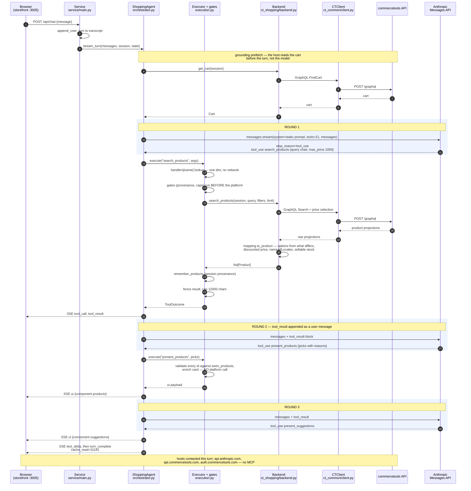
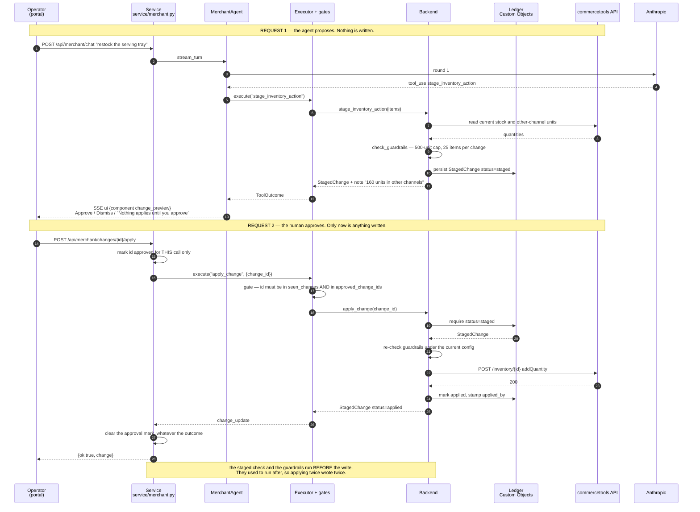

# Sequence diagrams

Drawn from the real traces in `WALKTHROUGH.md`, not from the design intent — the round
counts, the call fan-out and the concurrency are what `scripts/trace_turn.py` actually
recorded.

Mermaid renders in GitHub, Notion, Confluence and most slide tools. There is an ASCII
version of the first one at the bottom for a terminal or a plain slide.

---

## 1. Shopping path — "show me some chairs under $1000"



**Three things to point at:** the grounding prefetch happens before any model call; the
gates run before commercetools rather than after; and `present_products` never touches the
platform, so the model cannot put a product on screen that the session did not already see.

---

## 2. Merchant read path — "slow selling products from the past week"

```mermaid
sequenceDiagram
    autonumber
    participant B as Browser<br/>(portal :3105)
    participant S as Service<br/>service/merchant.py
    participant A as MerchantAgent<br/>orchestrator.py
    participant X as Executor + gates
    participant K as Backend<br/>ct_merchant/backend.py
    participant CT as commercetools API
    participant M as Anthropic<br/>Messages API

    B->>S: POST /api/merchant/chat {message}
    S->>S: operator read from server-side config,<br/>never from the request
    S->>A: stream_turn(messages, session, state)

    rect rgb(238, 244, 255)
    Note over A,M: ROUND 1
    A->>M: messages.stream(system, tools=21)
    M-->>A: tool_use load_skill {inventory-operations}
    end
    A->>X: execute("load_skill")
    X-->>A: SKILL.md from the in-process registry — no platform call

    rect rgb(238, 244, 255)
    Note over A,M: ROUND 2
    A->>M: messages + tool_result
    M-->>A: tool_use get_inventory_alerts {}
    end

    A->>X: execute("get_inventory_alerts")
    X->>K: get_inventory_alerts(session)
    Note over K,CT: commercetools has no alerts object.<br/>The alert is derived from three sources.
    K->>CT: REST /inventory where availableQuantity under 10
    CT-->>K: candidate skus
    K->>CT: REST /inventory where sku in (...)
    CT-->>K: per-channel quantities
    K->>CT: REST /orders where createdAt within 30d
    CT-->>K: order lines for sales velocity

    par four lookups run concurrently (asyncio.gather)
        K->>CT: /product-projections/search sku CST-01
    and
        K->>CT: /product-projections/search sku RAM-094
    and
        K->>CT: /product-projections/search sku RMP-01
    and
        K->>CT: /product-projections/search sku GRCG-01
    end
    CT-->>K: listings

    K->>K: sellable = channel-less entry;<br/>other_channels reported separately
    K-->>X: list[InventoryAlert] + note "window is 30 days"
    X->>X: fence
    X-->>A: ToolOutcome

    rect rgb(238, 244, 255)
    Note over A,M: ROUND 3
    A->>M: messages + tool_result
    M-->>A: tool_use present_digest
    end
    A-->>B: SSE ui {component digest}

    rect rgb(238, 244, 255)
    Note over A,M: ROUND 4
    A->>M: messages + tool_result
    M-->>A: tool_use present_suggestions, then end_turn
    end
    A-->>B: SSE ui, text_delta, turn_complete

    Note over A,B: the reply says "the data covers 30 days, not a week —<br/>no weekly pace is tracked" rather than inventing one
```

**One tool call, eight commercetools requests, four of them concurrent.** And the answer
corrects the question's premise instead of fabricating a weekly figure.

---

## 3. Merchant write path — propose, approve, apply

The one that answers "what stops it changing prices on its own". Two separate HTTP requests
by design: the agent proposes in one, a human approves in another.



---

## ASCII version of diagram 1, for a plain slide

```
Browser        Service         Agent          Executor       Backend        commercetools   Anthropic
   |              |              |                |              |                |             |
   |--POST chat-->|              |                |              |                |             |
   |              |--stream_turn>|                |              |                |             |
   |              |              |--get_cart----->|------------->|--GraphQL------>|             |
   |              |              |<-------------------------------Cart------------|             |
   |              |              |                |              |                |             |
   |              |              |==== ROUND 1 : system + 21 tools =============================>|
   |              |              |<=== tool_use search_products {chair, max 1000} ===============|
   |              |              |                |              |                |             |
   |              |              |--execute------>| handlers[name]|                |             |
   |              |              |                | gates FIRST   |                |             |
   |              |              |                |--search------>|--GraphQL------>|             |
   |              |              |                |               |<--projections--|             |
   |              |              |                |               | to_product()   |             |
   |              |              |                |<--[Product]---|                |             |
   |              |              |                | provenance + fence             |             |
   |<--SSE tool_call/result------|<---------------|               |                |             |
   |              |              |                |              |                |             |
   |              |              |==== ROUND 2 : + tool_result ================================>|
   |              |              |<=== tool_use present_products ==============================|
   |              |              |--execute------>| validate ids, enrich (NO platform call)      |
   |<--SSE ui {products}---------|<---------------|                                              |
   |              |              |==== ROUND 3 ================================================>|
   |              |              |<=== present_suggestions, end_turn ==========================|
   |<--SSE ui + text + turn_complete (cache_read=31181)                                          |
   |              |              |                |              |                |             |

hosts contacted: api.anthropic.com | api.commercetools.com | auth.commercetools.com
                 no MCP endpoint, in either direction
```
